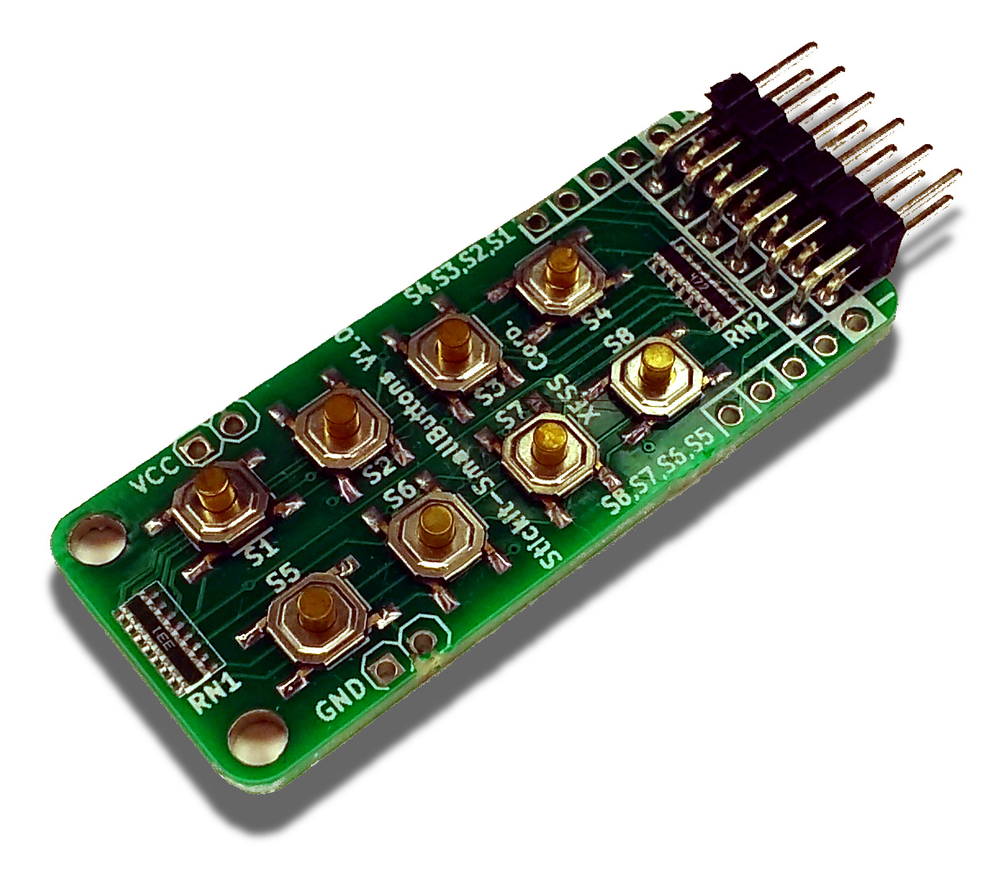

# StickIt! SmallButtons Module Repository

## Description

The StickIt-SmallButtons Module puts the power of eight pushbuttons into a small
module that is usable on a breadboard or through a PMOD connector.

* License: [CC BY 4.0](http://creativecommons.org/licenses/by/4.0/legalcode)
* Documentation: [https://xesscorp.github.io/StickIt-Smallbuttons](https://xesscorp.github.io/StickIt-Smallbuttons)

## Features

* It has eight independent, momentary-contact tact-switch buttons.
* Insertable into a solderless breadboard.
* Also usable through its PMOD interface.
* Small: 0.8" &times; 1.95".
* Compatible with the [StickIt! Motherboard](http://www.xess.com/shop/product/stickit-mb-4_0/).
* Completely open source.
* Did I mention it has **eight** buttons?

[ StickIt-SmallButtons Schematic ](https://xesscorp.github.io/StickIt-Smallbuttons/schematic.pdf)

